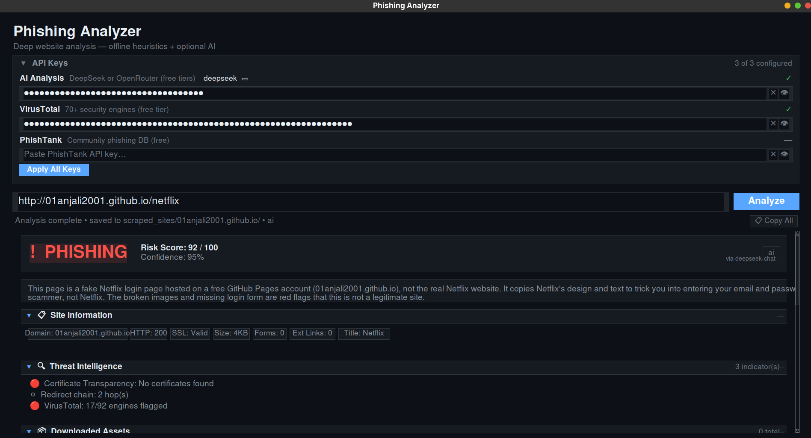

# 🔍 Automated Phishing Analyzer — AI-Powered

<p align="center">
  <a href="https://github.com/AbdurRahman-cybersec/Automated-Phishing-Analyzer-AI/blob/main/LICENSE"></a>
  <a href="https://www.python.org/downloads/"></a>
  
  
  <a href="https://github.com/AbdurRahman-cybersec/Automated-Phishing-Analyzer-AI/commits/main"></a>
</p>

A local desktop GUI tool that performs deep website analysis for phishing detection. Downloads all page assets, runs static JS/CSS analysis, queries threat intelligence sources, and uses AI (OpenRouter / DeepSeek) with automatic model fallback to classify URLs as **SAFE**, **SUSPICIOUS**, or **PHISHING**.

> **v2.0 — June 2026 Update:** Collapsible sections, persistent API key storage, OpenRouter free model selection with fallback, AI explanation display, plain-language verdicts, and Copy All.

<p align="center">
  
  <br><em>Full window with all sections expanded</em>
</p>

<p align="center">
  
  <br><em>Detailed AI analysis and threat intelligence findings</em>
</p>

---

## ✨ Features

### Core Analysis Engine
| Layer | What it checks |
|---|---|
| **Page Scraping** | Downloads full HTML, all JS/CSS/images, captures forms, links, iframes, meta tags |
| **Static Analysis** | Scans every JS file for obfuscation, redirects, credential patterns, DOM injection |
| **CSS Analysis** | Detects hidden elements, invisible overlays, brand spoofing, high z-index abuse |
| **Threat Intel** | WHOIS, Certificate Transparency (crt.sh), VirusTotal, PhishTank, Reputation DB |
| **Heuristic Scoring** | Weighted risk engine across 15+ signal categories |
| **AI Analysis** | OpenRouter (3 free models with fallback) or DeepSeek for comprehensive verdict |

### GUI Features (v2.0)
- **Dark theme** — GitHub-inspired color palette
- **Verdict card** with colored badge, risk score, confidence, and source tag
- **Plain-language explanation** — AI summarizes the verdict in simple terms anyone can understand
- **Collapse/Expand sections** — Click any section header to show or hide it (▶ / ▼)
- **Persistent API keys** — Keys are saved locally (base64-encoded, not plaintext) so you don't re-enter them
- **Delete individual keys** — ✕ button on each key row to remove and replace
- **Model selection** — Choose from 3 free OpenRouter models; if one fails, the next is tried automatically
- **AI Analysis Result** — View the AI's full response text in a dedicated section
- **Copy All** (📋) — One-click copy of the entire analysis to clipboard
- **Scrollbar** — Full mousewheel and click-drag scrolling for long results

### OpenRouter Free Model Fallback
The app ships with 3 verified free OpenRouter models:
| # | Model | ID |
|---|---|---|
| 1 (default) | Google Gemini 2.5 Flash Lite | `google/gemini-2.5-flash-lite:free` |
| 2 | Meta Llama 4 Maverick | `meta-llama/llama-4-maverick:free` |
| 3 | DeepSeek Chat V3 | `deepseek/deepseek-chat-v3-0324:free` |

If the primary model returns a 404 or times out, the analyzer automatically tries the next model — no manual switching needed.

---

## 🚀 Quick Start

### 1. Clone the repo

```bash
git clone https://github.com/AbdurRahman-cybersec/Automated-Phishing-Analyzer-AI.git
cd Automated-Phishing-Analyzer-AI
```

### 2. Install dependencies

```bash
pip3 install -r requirements.txt
```

Or install directly:

```bash
pip3 install requests beautifulsoup4 python-dotenv
```

### 3. Get an OpenRouter API key (free)

1. Go to [https://openrouter.ai/keys](https://openrouter.ai/keys)
2. Create a free account
3. Generate an API key

### 4. Run

```bash
python3 phishing_analyzer_gui.py
```

Paste your API key into the **🔑 API Keys** panel (expand by clicking the header), select a model from the dropdown, and click **Apply All Keys**. Your key is saved and will be loaded automatically next time.

---

## 🔑 API Keys

### In-GUI Key Management (recommended)
- Expand the **API Keys** panel at the top
- Paste keys for AI Analysis (OpenRouter/DeepSeek), VirusTotal, and PhishTank
- Keys are **base64-encoded** and saved to `.api_keys` in the project folder
- Click **✕** on any key row to delete and replace it
- Use the **Model** dropdown to pick from 3 free OpenRouter models
- Click **Apply All Keys** to save

### Via `.env` file (optional)
```
OPENROUTER_API_KEY=your_key_here
OPENROUTER_MODEL=google/gemini-2.5-flash-lite:free
```

---

## 🖥️ GUI Layout

```
┌─────────────────────────────────────────────┐
│  Phishing Analyzer                          │
│  Deep website analysis — offline + AI       │
├─────────────────────────────────────────────┤
│  ▼ API Keys (expandable)                    │
│    AI Analysis  [openrouter ▼]  [model ▼]  │
│    [••••••••••••••]  👁 ✕                   │
│    VirusTotal   [••••••••••••••]  👁 ✕      │
│    PhishTank    [••••••••••••••]  👁 ✕      │
│    [Apply All Keys]                         │
├─────────────────────────────────────────────┤
│  [Enter URL to analyze…]  [Analyze]         │
│  Analysis complete • onehack.st     [📋Copy] │
├─────────────────────────────────────────────┤
│  ┌─ VERDICT ──────────────────────────────┐ │
│  │  ⚠ SUSPICIOUS   Risk: 19/100          │ │
│  │                  Confidence: 39%       │ │
│  └────────────────────────────────────────┘ │
│  This site shows several warning signs...   │
│                                             │
│  ▼ 📋  Site Information                     │
│  ▼ 🔍  Threat Intelligence                  │
│  ▶ 📦  Downloaded Assets                    │
│  ▼ 🤖  AI Analysis Result                   │
│  ▶ 📜  JavaScript Analysis                  │
│  ▼ 📝  Findings Summary                     │
└─────────────────────────────────────────────┘
```

---

## 📁 Project Structure

```
.
├── phishing_analyzer_gui.py   # Desktop GUI (tkinter, dark theme)
├── url_scraper.py             # Scraping + AI analysis + heuristics
├── bot.js                     # Discord bot for DM-based URL checking
├── pyproject.toml             # Python package metadata
├── requirements.txt           # Python dependencies
├── .api_keys                  # Saved API keys (base64, gitignored)
├── .gitignore
├── .env.example               # Example environment file
├── scraped_sites/             # Analysis output per domain (gitignored)
│   └── domain.com/
│       ├── page.html
│       ├── extracted_data.json
│       └── analysis.json
├── screenshots/
│   ├── full-window.png
│   └── analysis-result.png
└── README.md
```

---

## 🔄 Analysis Pipeline

1. **Normalize URL** → add `https://` if missing
2. **Download page** → capture HTML, headers, status
3. **WHOIS lookup** → domain age, registrar
4. **Certificate Transparency** → crt.sh log check
5. **Extract fields** → forms, links, scripts, iframes, meta, SSL, favicon
6. **Download all assets** → JS, CSS, images
7. **Static JS analysis** → obfuscation, redirects, credential theft patterns
8. **Static CSS analysis** → hidden elements, overlays, brand spoofing
9. **Favicon analysis** → hash comparison against known brands
10. **Redirect chain** → detect cross-domain redirects
11. **VirusTotal + PhishTank** → external threat DB lookups
12. **Heuristic scoring** → weighted risk calculation
13. **AI analysis** → OpenRouter with automatic model fallback
14. **Display results** → verdict card + collapsible detailed sections

---

## 🛠️ Tech Stack

| Component | Technology |
|---|---|
| GUI | Python `tkinter`, dark theme |
| HTTP | `requests` |
| HTML parsing | `beautifulsoup4` |
| AI API | OpenRouter (primary) / DeepSeek |
| Config | `.env` + `.api_keys` (base64) |
| Storage | Local JSON files per domain |

---

## ⚙️ Configuration

| Setting | Where | Default |
|---|---|---|
| AI Provider | GUI dropdown or `.env` | `openrouter` |
| AI Model | GUI dropdown or `.env` | `gemini-2.5-flash-lite:free` |
| OpenRouter Key | GUI or `.env` | — |
| DeepSeek Key | GUI or `.env` | — |
| VirusTotal Key | GUI or `.env` | — |
| PhishTank Key | GUI or `.env` | — |

---

## 📝 Changelog

### v2.0 — June 29, 2026
- **Collapse/Expand** — every result section is independently collapsible
- **Persistent API keys** — base64-encoded local storage, auto-load on startup
- **Delete key button** — ✕ on each key row to clear and replace
- **Model selector** — dropdown with 3 verified free OpenRouter models
- **Model fallback** — if primary model fails, automatically tries next 2
- **AI Analysis Result section** — view the AI's full reasoning text
- **Plain-language explanation** — AI explains the verdict in simple terms
- **Copy All button** — one-click clipboard copy of full analysis
- **Scrollbar** — proper scrollbar with mousewheel support
- **Redesigned spacing** — consistent gaps, no overlapping elements
- **Chip-style tags** — Site Info section with flowing tag grid
- **Sections redesigned** — clear headers, dividers, visual hierarchy

### v1.0 — May 2025
- Initial release
- Glassmorphism GUI
- OpenRouter AI integration
- Basic scraping and heuristics

---

## 📄 License

MIT
